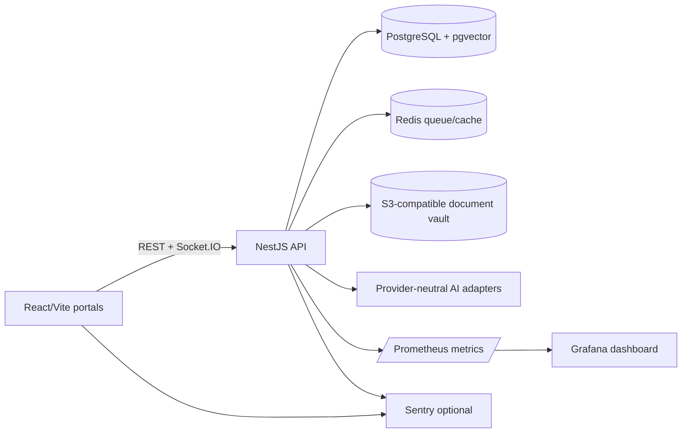

# JustiQ

[](https://github.com/anoushkasatpathi/judicial-case-management-system/actions/workflows/ci.yml)

JustiQ is an AI-powered Judicial Case Management System for case filing, hearing scheduling, courtroom allocation, public case lookup, and human-reviewed legal intelligence.

## Architecture



## Features

- Role-based Judge, Advocate, Registrar, Admin, and public portals
- Deterministic explainable priority queue with emergency workflow and WebSocket updates
- Hash-chained audit trail with verification endpoint
- Document vault with checksums, virus-scan lifecycle, OCR fallback, and RAG summaries
- Human-reviewed petition extraction, bounded AI priority hints, and draft orders
- Production CI, Docker images, Prometheus/Grafana observability, and ECS Terraform skeleton

## Stack

| Area | Technology |
| --- | --- |
| Frontend | React, Vite, TypeScript, TailwindCSS, shadcn/ui |
| Backend | NestJS, TypeScript |
| Shared contracts | TypeScript package at `packages/shared-types` |
| Data | PostgreSQL with pgvector |
| Infrastructure | Docker Compose, Redis, MinIO |
| AI direction | Structured extraction, RAG summaries, priority suggestions, draft orders |

## Repository layout

- `apps/api`: NestJS backend
- `apps/web`: React + Vite frontend
- `packages/shared-types`: shared TypeScript interfaces
- `infra`: local PostgreSQL, Redis, and MinIO services
- `.github/workflows`: GitHub Actions CI and GHCR publishing
- `infra/observability`: Prometheus/Grafana assets
- `infra/terraform`: AWS ECS/Fargate deployment skeleton

## Run locally

Prerequisites: Node.js 22+ and Docker Desktop.

```powershell
npm install

docker compose -f infra/docker-compose.yml up -d

Copy `.env.example` to `.env`, set `DATABASE_URL` and `REDIS_URL`, then initialize:

npx prisma migrate deploy --schema apps/api/prisma/schema.prisma
npm run prisma:seed --workspace apps/api

npm run dev:api
# In a second terminal:
npm run dev:web
```

## Test and build

Run the same checks used by CI:

```powershell
npm run lint
npm test
npm run test:e2e --workspace apps/api
npm run build
```

The API exposes Prometheus metrics at `/metrics`. Set `SENTRY_DSN` for backend
error tracking or `VITE_SENTRY_DSN` for frontend error tracking; without a DSN,
both integrations are no-ops.

Security hardening includes Helmet, allowlisted CORS via `CORS_ORIGINS`, strict
DTO validation, and named rate limits for authentication and public lookup.
`npm audit --omit=dev` currently has no critical findings; the remaining high
advisory is isolated to Prisma CLI's transitive `deepmerge-ts` dependency, whose
automated fix requires a breaking Prisma downgrade.

## Docker

Build both production images from the repository root:

```powershell
docker build -f apps/api/Dockerfile -t justiq-api:local .
docker build -f apps/web/Dockerfile -t justiq-web:local .
docker run --rm --env-file .env -p 3000:3000 justiq-api:local
docker run --rm -p 8080:80 justiq-web:local
```

## Deployment

`infra/terraform` contains a deliberately disabled AWS ECS/Fargate skeleton.
It expects pre-existing networking, IAM roles, secrets, database, Redis, and
TLS/load-balancer infrastructure. Review those inputs and set `enable = true`
only after the target account's security and operations requirements are ready.

## Why these choices

- **NestJS + TypeScript:** shared contracts, structured modules, and strong fit for a small full-stack team.
- **PostgreSQL + pgvector:** transactional case data and retrieval embeddings stay together.
- **Redis:** fast deterministic queue reads and a natural path to rate limiting and background work.
- **S3-compatible storage:** MinIO keeps local development close to production S3 semantics.
- **Provider-neutral AI adapters:** OpenAI, Gemini, or local models can change without changing court workflows; human review remains authoritative.
- **ECS/Fargate skeleton:** a smaller operational step than Kubernetes while retaining immutable images, task roles, and CloudWatch logs.

See [DEMO_SCRIPT.md](DEMO_SCRIPT.md) for the five-minute walkthrough and
[PERFORMANCE.md](PERFORMANCE.md) for the repeatable k6 baseline procedure.
